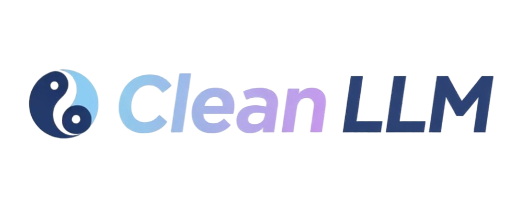

# Clean LLM

中文 | [English](./README_en.md)

这是一个受 [nanoGPT](https://github.com/karpathy/nanoGPT) 和 [Stanford CS336](https://github.com/stanford-cs336) 启发的 LLM 学习项目。致力于从零实现整个大模型训练流程，包括预训练数据清洗、模型预训练、SFT、GRPO 等。

## News
- [2025.07.10]：新增了从零训练分词器的代码。
- [2025.07.08]：新增了使用自训练分词器进行从零大模型预训练的代码。
- [2025.07.07]：***nanoQwen***：从零实现了 Qwen2.5 并支持从 Huggingface 加载预训练模型。

## 训练 CS336 语言模型

1. 训练分词器 `uv run python -m scripts.train_tokenizer`，耗时3分钟
2. 编码文本数据 `uv run python -m scripts.tokenize`，耗时6分钟
3. 训练模型 `uv run python -m scripts.pretrain`，耗时35分钟
4. 评估模型 `uv run python -m scripts.eval_pretrain`
（注：所有耗时基于 Mac 笔记本电脑评测，数据集为 TinyStories-train）

## 从零实现大语言模型

### 运行 Qwen2.5
1. 将模型下载到 `huggingface_models` 文件夹内。
2. 运行 `uv run python -m scripts.test_qwen2_5`，即可将开源权重加载到你自己的从零实现的大语言模型中并生成文本。

### 运行 DeepseekV2
待更新。

## 从零训练分词器

1. 下载训练数据并放在 `data/txt` 文件夹下。
2. 根据需求编辑 `scripts/configs/train_tokenizer.yaml` 配置文件。
3. 运行 `uv run python -m scripts.test_train_tokenizer`，即可从零训练你的分词器。
4. 最终分词器文件会保存在你在配置文件 `tokenizer_dir` 指定的目录下。

## 预训练数据清洗
待更新。

## 预训练
1. 在 `data` 文件夹下下载好预训练数据。
2. 运行 `uv run python -m scripts.test_pretrain`，可以对自己的大语言模型进行从零预训练。
3. 运行 `uv run python -m scripts.test_eval_pretrain`，对预训练好的语言模型进行评估。

## SFT & GRPO
待更新。

## Reference
- [nanoGPT](https://github.com/karpathy/nanoGPT)
- [Stanford CS336](https://cs336.stanford.edu/)
- [A fast tokenizer implementation](https://zhuanlan.zhihu.com/p/1920487178846344415)