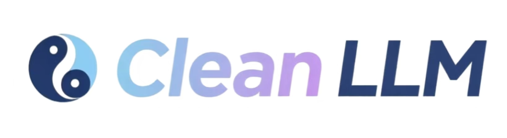

[中文](./README.md) | English

This is an LLM learning project inspired by [nanoGPT](https://github.com/karpathy/nanoGPT) and [Stanford CS336](https://github.com/stanford-cs336). It is dedicated to implementing the entire LLM training pipeline from scratch, including training of tokenizer, data cleaning, model pre-training, SFT, GRPO, and more.

## News
- [2023.07.12]Added [A comprehensive guide to CS336 assignment 1](./guide.md)。

- [2025.07.10]: Added code for training tokenizers from scratch.

- [2025.07.08]: Added code for pretraining LLMs from scratch with a custom-trained tokenizer.

- [2025.07.07]: ***nanoQwen***: Added Qwen2.5 implementations from scratch and enabled loading of pretrained models from Huggingface.

## Train CS336 LM 

1. 训练分词器 `uv run python -m scripts.train_tokenizer`，耗时3分钟
2. 编码文本数据 `uv run python -m scripts.tokenize`, 耗时6分钟
3. 训练模型 `uv run python -m scripts.pretrain`，耗时35分钟
4. 评估模型 `uv run python -m scripts.eval_pretrain`  
（注：所有耗时基于Mac笔记本电脑评测，数据集是TinyStories-train）

## Implement LLMs from Scratch

### Running Qwen2.5
1. Download models in the `huggingface_models` folder.  
2. Run `uv run python -m scripts.test_qwen2_5` to load the open-source weights into your own implementation of the LLM from scratch and generate text.

### Running DeepseekV2
To be updated.

## Train Tokenizer from Scratch

1. Download the training data and place it in the `data/txt` folder.
2. Edit the configuration file at `scripts/configs/train_tokenizer.yaml` as needed.
3. Run `uv run python -m scripts.test_train_tokenizer` to start training your tokenizer from scratch.
4. The resulting tokenizer files will be saved in the directory you specified as `tokenizer_dir` in the config file.

## Pretrain Data Cleaning
To be updated.

## Pretrain
1. Download pretrain data in the `data` folder.
2. Run `uv run python -m scripts.test_pretrain` to pretrain your own LLM from scratch.
3. Run `uv run python -m scripts.test_eval_pretrain` to evaluate your pretrained LLM.

## SFT & GRPO
To be updated.

## Reference
- [nanoGPT](https://github.com/karpathy/nanoGPT)
- [Stanford CS336](https://cs336.stanford.edu/)
- [A fast tokenizer implementation](https://zhuanlan.zhihu.com/p/1920487178846344415)

## 🫶Supporters

<picture>
  <source media="(prefers-color-scheme: dark)" srcset="https://api.star-history.com/svg?repos=wingAGI/clean-llm&type=Date&theme=dark"/>
  <source media="(prefers-color-scheme: light)" srcset="https://api.star-history.com/svg?repos=wingAGI/clean-llm&type=Date"/>
  
</picture>

# License

This repository is licensed under the [Apache-2.0 License](LICENSE).