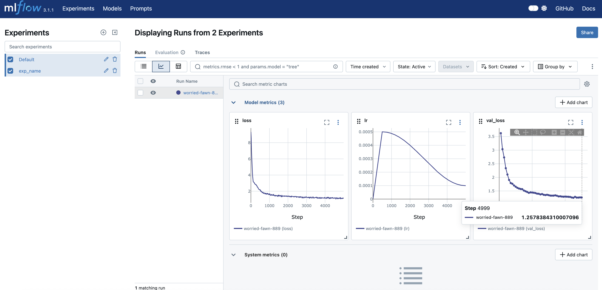

# 开始使用
1. 安装uv
```bash
curl -LsSf https://astral.sh/uv/install.sh | sh
source $HOME/.local/bin/env
```
2. 克隆项目
```bash
git clone https://github.com/wingAGI/clean-llm.git
cd clean-llm
```
3. 下载预训练数据
```bash
cd data/txt
bash download_ts.sh  # 下载TinyStories数据集（较小），默认配置下使用该数据集
bash download_owt.sh # 下载OpenWebText数据集（较大），如果你需要的话
```
4. [可选] 根据你的需要修改训练Tokenizer的配置文件`scripts/configs/tokenizer.yaml`。默认情况下，它将使用TinyStories数据集的训练集进行训练，并将得到的Tokenizer保存到`tokenizers/TinyStoriesV2-GPT4-train/`目录中。
5. 训练Tokenizer
```bash
cd ../..
uv run python -m scripts.train_tokenizer
```
运行后，`uv`会自动创建虚拟环境并安装所需的依赖项，然后运行训练脚本。
6. 将文本数据编码成Token并保存，以便后续训练LLM
```bash
uv run python -m scripts.tokenize
```
运行后，训练集和验证集都会被编码，并保存到`data/dat/`目录下。
7. 开始预训练
```bash
uv run python -m scripts.pretrain
```
默认会训练cs336的语言模型，你可以根据需要修改`scripts/configs/pretrain.yaml`中的配置。  
训练时间参考：mac上36分钟，单卡4090上10分钟。
8. 观察训练日志
```bash
uv run mlflow server
```
运行后，打开浏览器访问`http://127.0.0.1:5000`，查看训练日志。可以看到如下图所示的内容：
  
可以看到，验证集损失在1.26左右。大家可以在`scripts/configs/pretrain.yaml`中调整训练配置，比如训练更多步数。
9. 测试预训练模型
```bash
uv run python -m scripts.eval_pretrain
```
运行后，会输出模型生成的样本：
```
输入： Once upon a time, there is a little boy
生成结果： Once upon a time, there is a little boy named Tim. Tim loved to play outside in his sun in the summer cold. One day, he heard a sound coming from outside his house. Tim looked up and saw
```